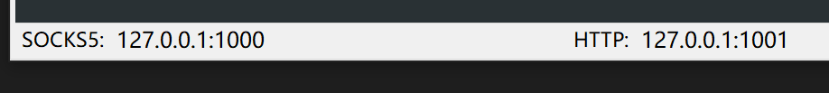
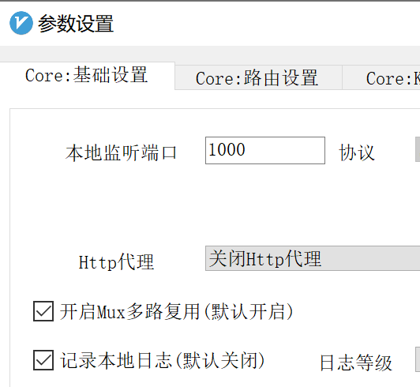
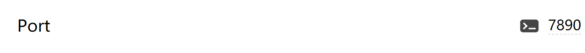

# How to use proxies in some console

本文假设设置 `HTTP` 代理端口为 `1001`.

#### WSL

```sh
export http_proxy="http://127.0.0.1:1001"
export https_proxy="http://127.0.0.1:1001"
```

#### cmd

```sh
set http_proxy=http://127.0.0.1:1001
set https_proxy=http://127.0.0.1:1001
```
#### PowerShell

```sh
$Env:http_proxy="http://127.0.0.1:1001"
$Env:https_proxy="http://127.0.0.1:1001"
```

#### Git (msys2)

```sh
git config --global https.proxy http://127.0.0.1:1001
git config --global https.proxy https://127.0.0.1:1001
git config --global --unset http.proxy
git config --global --unset https.proxy
npm config delete proxy
```

### 如何查看端口

#### v2rayN



##### 关于 v2rayN 开启全局模式时

v2rayN 里设置端口为 `1000` (如下图)并开启全局模式时,设置 `Socks5` 端口为 `1000` 的同时,自动设置 `HTTP` 端口为 `1001`.


#### Clash



#### 其它系统/软件请自强

