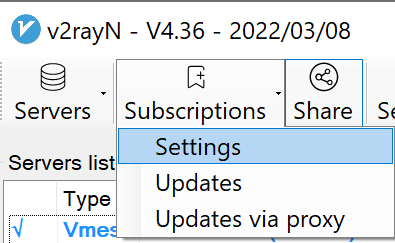

## v2rayN

#### 下载

[GitHub](https://github.com/2dust/v2rayN/releases/download/4.36/v2rayN-Core.zip)
[阿里云分流](http://39.102.76.82/1.zip) 

#### 使用

1. 双击蓝色图标打开, **Subscriptions** - **Settings**;

2. 点击 **Add** 新增订阅配置，**url** 处粘贴你的订阅链接;

3. **Subscriptions** - **Updetes** 更新订阅;

4. 右键屏幕右下角的图标,选择一个节点;

5. 右键屏幕右下角的图标, **System proxy** - **Set system proxy** 开启全局代理;

6. 开启全局代理后,右下角的图标会变成红色.

