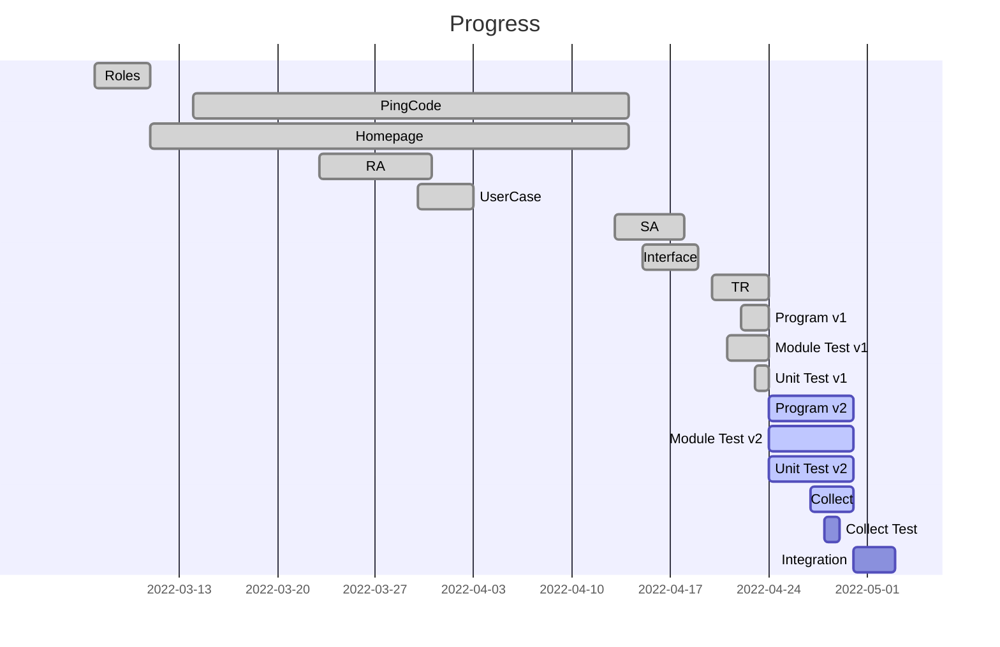
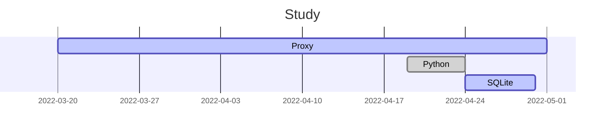

# Happy Family

[Weekly Report](./Weekly%20Report/README.md)

[Meetings](./Meetings/README.md)

[Knowledge](./Knowledge/README.md)

[SRS](./Others/SRS.md)

[SDS](./Others/SDS.md)

### Member

#### 柏羽 / Elaina
- **Roles**: Project Manager + Tester
- **Skype ID**: `live:.cid.3ae636c922880a13`
- **Email**: userelaina@pm.me
- **GitHub**: https://github.com/userElaina
- **Program Language**: Multilingual, especially experienced in **C** and **Python**
- **Skills**: Have experience with **Git**, **GitHub**, and **Nginx**

#### 邓向萍 / Xiangping
- **Roles**: Requirement Analyst + Programmer
- **Skype ID**: `live:.cid.c56a304d85d2fb37`
- **Email**:
- **Program Language**: **C++** and **Java**
- **Skills**: Have experience with **Linux**

#### 程依若 / Ariya
- **Roles**: Liaison + Requirement Analyst
- **Email**:
- **Skype ID**: `live:.cid.9a1959f6efa13050`
- **Program Language**: Good at **C**, **C++**, **Java** and **Python**
- **Skills**: Good at **English** and **Operating System**

#### 白小杨 / Xiaoyang
- **Roles**: System Analyst + Programmer
- **Email**:
- **Skype ID**: `live:.cid.fe180ad6a80a693f`
- **Program Language**: **Java**, **C++**, **JavaScript** and **MATLAB**
- **Skills**: Have experience with **Java** engineering practice

### Platform and Tools

     

  )     

     
